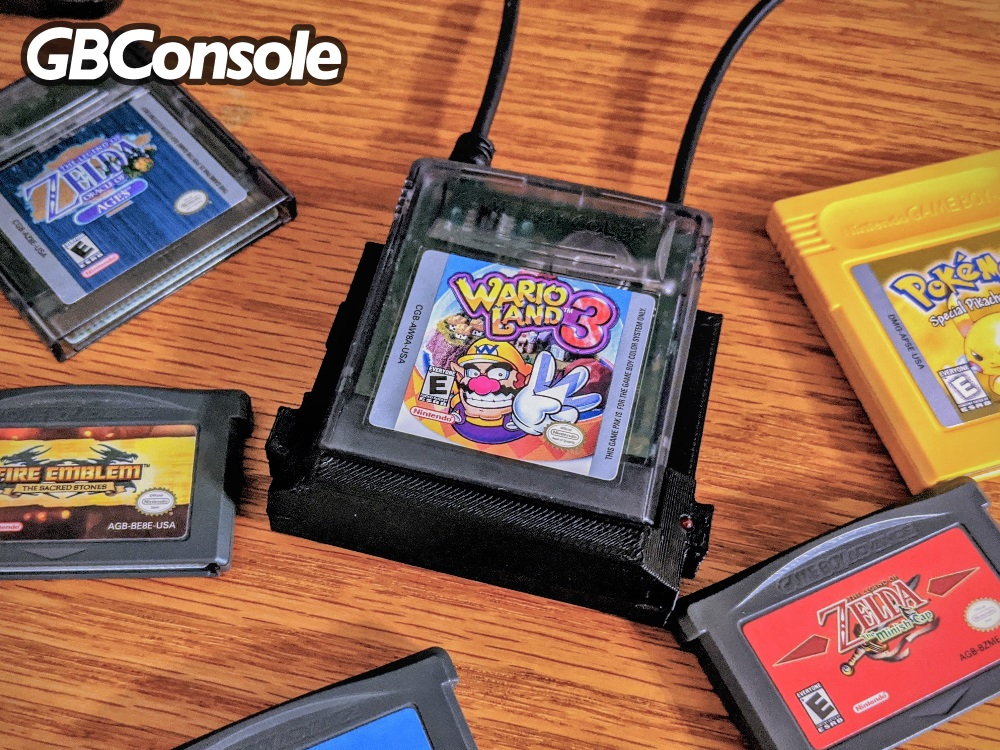
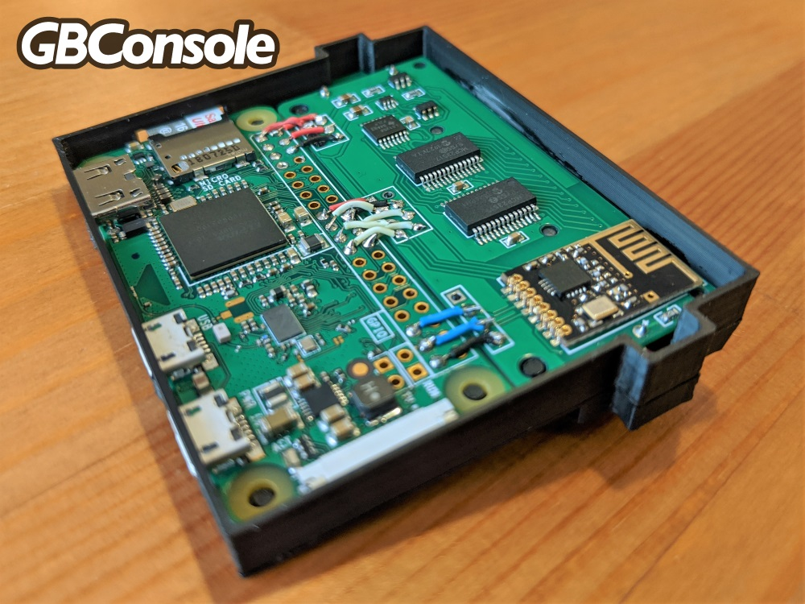
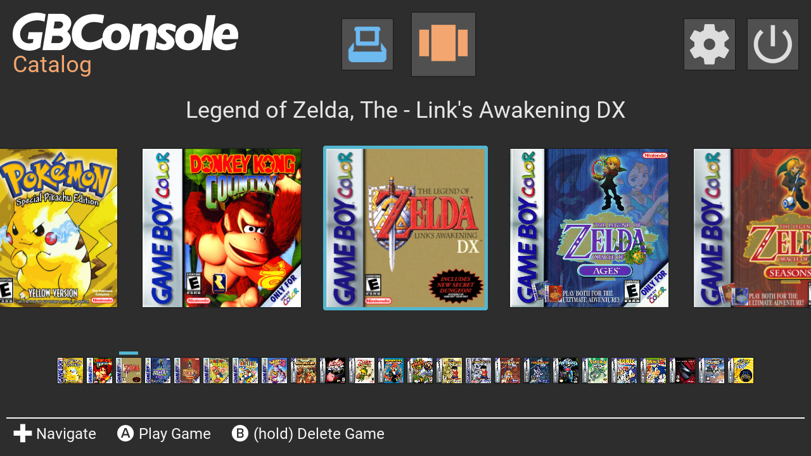

# GameBoy Console
The GameBoy Console is an emulator that plays physical GameBoy, GameBoy Color and GameBoy Advance cartridges on your TV! The goal of this project is to provide an inexpensive solution for revisiting beloved GameBoy games on the big screen and help preserve cartridge save data.

## Documentation
Refer to the following links for more info on the assembly and features of the GameBoy Console.
* [Case Assembly](/case)
* [PCB Assembly](/pcb)
* [Software Setup](https://github.com/pixelcircuits/GBConsole)
* [User Guide](/guide)
