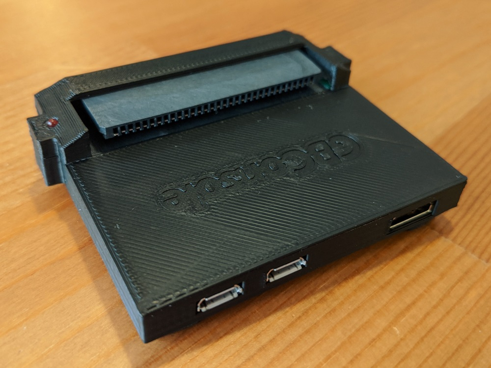
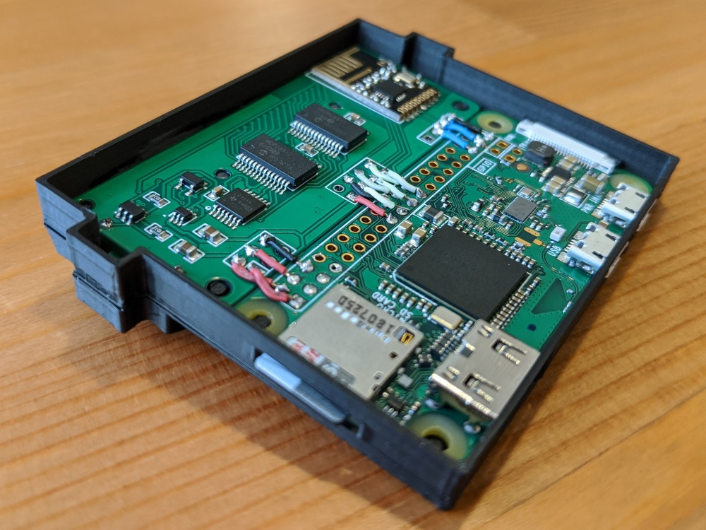
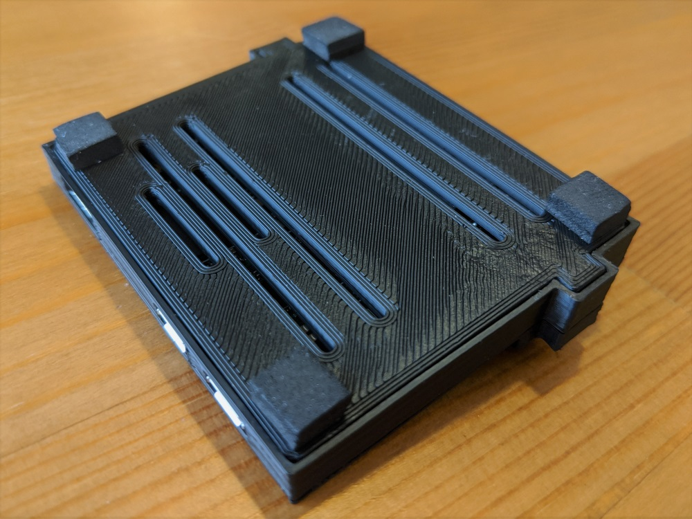
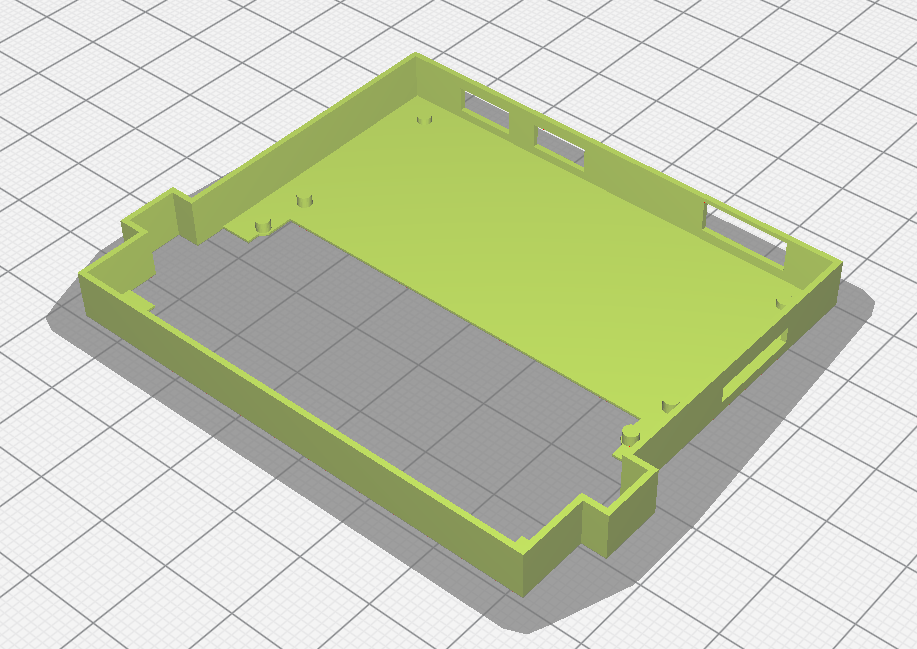
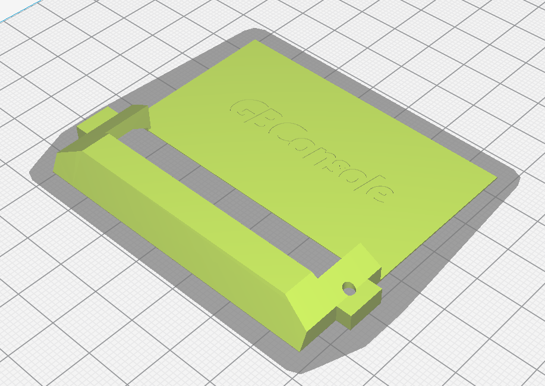
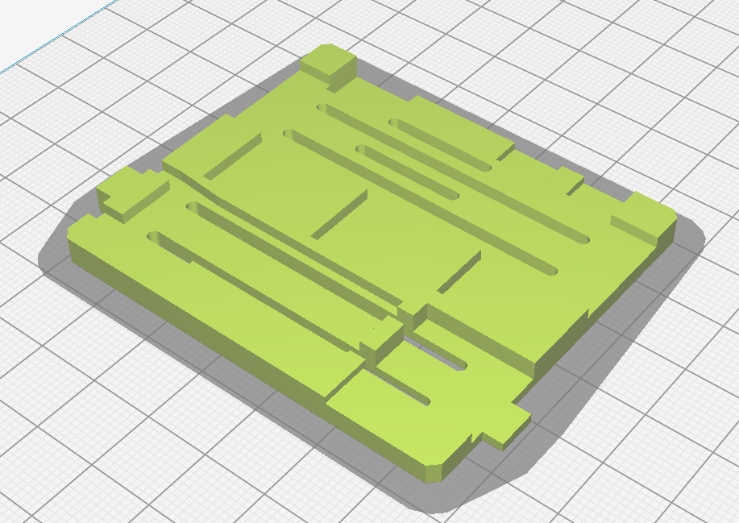

# GameBoy Console Case

The GameBoy Console was designed to fit nicely into a 3D printed case. The case consists of two main parts (body and bottom).

## Case Body
The case body is split into two parts (top and body) to make printing more manageable. These two pieces should be glued together after printing. If printing in ABS, you can use a small paint brush to brush acetone across the join line to bond the parts and make the part stronger.
|  |  |
| --- | --- |
| [GBConsole_Body.stl](GBConsole_Body.stl) | [GBConsole_Top.stl](GBConsole_Top.stl) |

## Case Bottom
The bottom of the case prints in one piece. Rubber feet should be applied to the four corners to elevate the case and allow airflow to carry away heat.
|  |
| --- |
| [GBConsole_Bottom.stl](GBConsole_Bottom.stl) |

## Assembly
To assemble the GameBoy Console case, fit the fully soldered circuitry into the top of the case by placing in the Raspberry Pi side first (make sure to remove the SD card). The case bottom should then fit and lock into place from the print lines. Refer to the photos if you need additional help.
