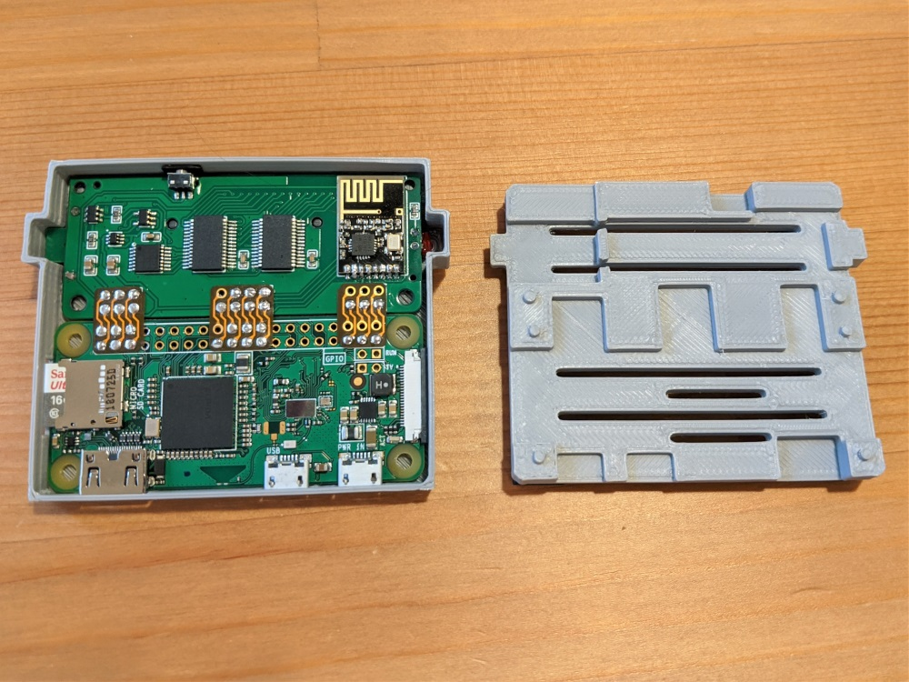
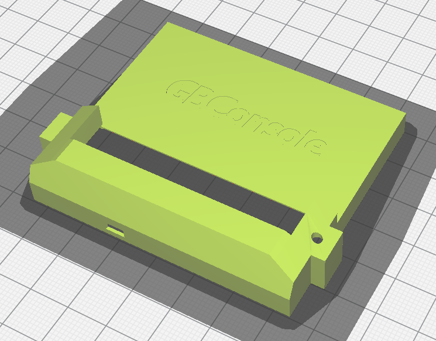
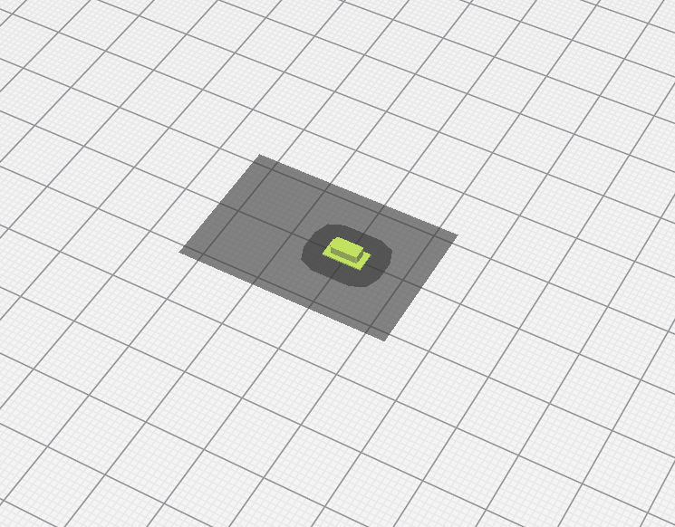

# GameBoy Console Case

The GameBoy Console was designed to fit nicely into a 3D printed case. The case consists of two main parts (body and bottom).

## Case Body
The case body is split into two parts (top and bottom). These two pieces should friction fit together with all the circuitry placed inside. Rubber feet should be applied to the bottom four corners to elevate the case and allow airflow to carry away heat.
|  |  |
| --- | --- |
| [GBConsole_Top.stl](stl/GBConsole_Top.stl) | [GBConsole_Bottom.stl](stl/GBConsole_Bottom.stl) |

## Case Button
Additionally, there is a small button cap to help trigger the tact switch through the front side of the case.
|  |
| --- |
| [GBConsole_Button.stl](stl/GBConsole_Button.stl) |

## Assembly
To assemble the GameBoy Console case, fit the fully soldered circuitry into the top of the case by placing in the Raspberry Pi side first (make sure to remove the SD card). The case bottom should then fit and lock into place from the print lines. Refer to the photos if you need additional help.
