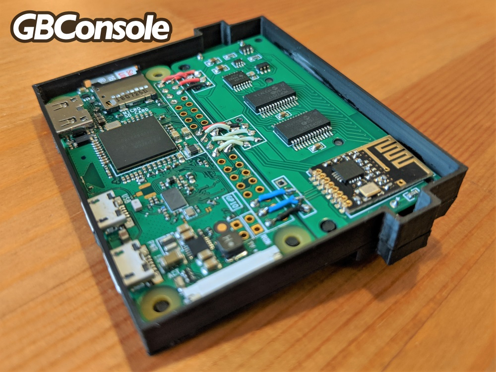
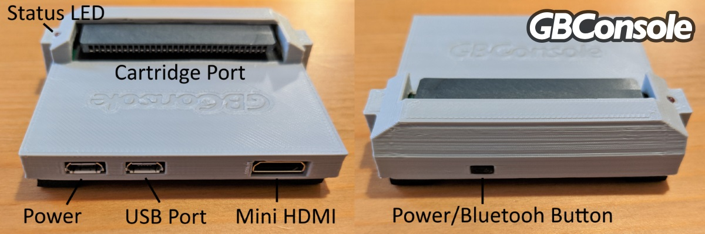
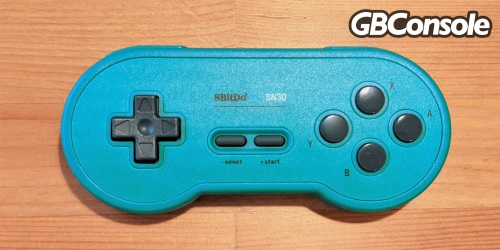
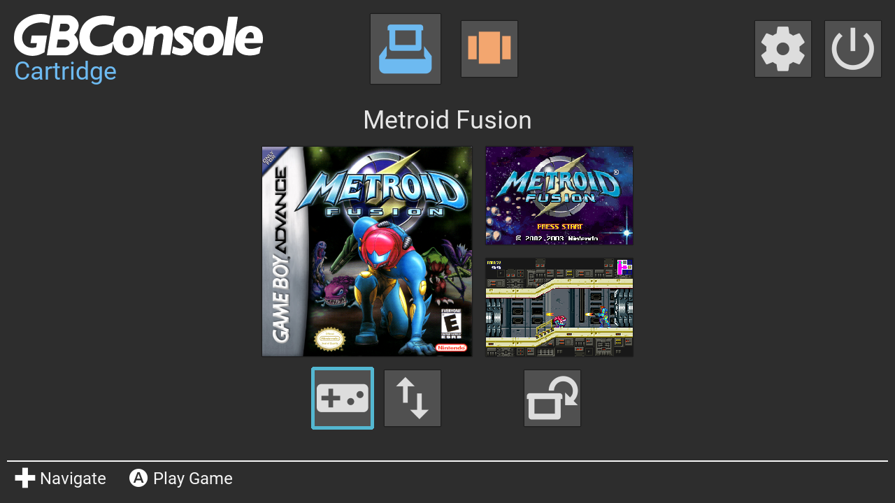
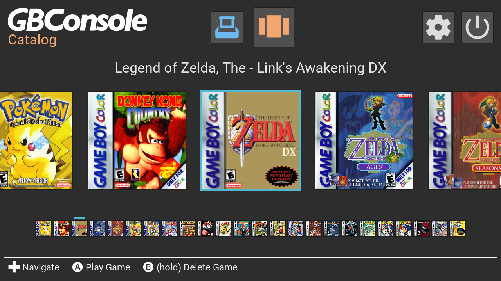

# User Guide

1. [Overview](#Overview)
   * [Connecting Cartridges](#Overview_ConnectingCartridges)
   * [Hardware Layout](#Overview_HardwareLayout)
   * [Power On/Off](#Overview_PowerOnOff)
   * [BIOS Files](#Overview_BIOSFiles)
2. [Controls](#Controls)
   * [Keyboard](#Controls_Keyboard)
   * [8bitdo](#Controls_8bitdo)
   * [Wireless Game Receiver](#Controls_WirelessGameReceiver)
3. [Cartridge](#Cartridge)
   * [Load](#Cartridge_Load)
   * [Sync](#Cartridge_Sync)
   * [Play](#Cartridge_Play)
4. [Catalog](#Catalog)
   * [Browse](#Catalog_Browse)
   * [Play](#Catalog_Play)
   * [Delete](#Catalog_Delete)
5. [Settings](#Settings)
   * [General](#Settings_General)
   * [USB Backup/Restore](#Settings_USBBackupRestore)
   * [Bluetooth](#Settings_Bluetooth)

## 1. Overview 
The GameBoy Console is an emulator that plays physical GameBoy, GameBoy Color and GameBoy Advance cartridges on your TV! The goal of this project is to provide an inexpensive solution for revisiting beloved GameBoy games on the big screen and help preserve cartridge save data. Additionally, the system hardware supports connecting to the [Wireless Gameboy Controller](https://shop.insidegadgets.com/product/wireless-gameboy-controller//) cartridge to enable playing on your TV while using your Gameboy as a controller!

### Connecting Cartridges 
The cartridge connector supports GameBoy, GameBoy Color and GameBoy Advance cartridges. Only when the status LED is on is the cartridge receiving power. When the status LED is off, you are free to connect and disconnect cartridges. The system runs on a syncing concept where cartridges are cloned onto the system and put into a virtual catalog. The cartridge then no longer needs to be connected to play and only needs to be connected to transfer updated save data back to the cartridge. Similarly, if cartridge save data has been updated, running the sync process allows for the system save data to be updated to the cartridge state.

### Hardware Layout 
The GameBoy Console is powered by a Raspberry Pi zero. A connected SD card contains the operating system and stores all data of the backed up cartridges for the catalog. Refer to the following diagram for locating the Status LED, Power/Bluetooth Button, Micro USB power connector, Micro USB peripheral port and Mini HDMI port.

### Power On/Off 
The GameBoy Console should boot up when the power is first plugged in. To quickly and easily shut down the system, hold down the button on the front of the case. Once shutdown, simply press the front button to have the system boot up again. Additionally, you can manually shutdown from the system menu by selecting the shutdown icon  at the top of the system menu. You will then be prompted to confirm you want to shut down the system. Failing to shutdown the system safely could result in corruption of the SD card and potential loss of data.

### BIOS Files 
Currently, fast GameBoy Advance emulation requires that you provide a GBA bios file. This file should be named "gba_bios.bin" and placed at the root of a connected USB drive or on the SD card boot partition. On boot, the GameBoy Console will look for this file and copy it to the system if it is found. Once copied, the file no longer needs to be on the USB drive or SD card boot partition.

## 2. Controls 
The GameBoy Console supports the following controller options.

### Keyboard 

The most straight forward controller option is a standard keyboard connected to the USB port. Refer to the following chart for the keyboard key mapping.

| Up       | Down       | Left       | Right       | Select      | Start | A     | B     | L     | R     |
|:-------- |:---------- |:---------- |:----------- |:----------- |:----- |:----- |:----- |:----- |:----- |
| Up Arrow | Down Arrow | Left Arrow | Right Arrow | Right Shift | Enter | X Key | Z Key | Q Key | W Key |

*Hotkeys*

| Exit | Save Slot Increase | Save Slot Decrease | Save State | Load State | Fast Forward | Pause |
|:---- |:------------------ |:------------------ |:---------- |:---------- |:------------ |:----- |
| Esc  | F7                 | F6                 | F2         | F4         | Space        | P Key | 

### 8BitDo 

Currently, the only controllers supported are the [SN30](https://www.8bitdo.com/sn30-gp/) and [SN30 Pro](https://www.8bitdo.com/sn30-pro-g-classic-or-sn30-pro-sn/) from 8BitDo. These can be plugged into the USB port or optionally connected via bluetooth (see [Settings](#Settings_Bluetooth)). Holding the X key enables the use of the following hotkeys.

| Exit    | Save Slot Increase | Save Slot Decrease | Save State | Load State | Fast Forward | Pause    |
|:------- |:------------------ |:------------------ |:---------- |:---------- |:------------ |:-------- |
| X+Start | X+Right            | X+Left             | X+Up       | X+Down     | X+A          | X+Select |

### Wireless Gameboy Controller 

The GameBoy Console also supports connecting to the [Wireless Gameboy Controller](https://shop.insidegadgets.com/product/wireless-gameboy-controller//) from insideGadgets. Make sure the controller is set to its defaults and it should connect automatically. Hotkeys can only be used from a different connected controller or keyboard. To exit a game with this controller, simply hold down A+B+L+R+Start+Select.

## 3. Cartridge 
The cartridge section of the menu can be opened by selecting the blue cartridge icon  at the top of the system menu. This is the main section for performing actions with physically connected cartridges *(note that you are free to connect and disconnect cartridges from the system as long as the status LED is not on)*. From here you can perform the following operations.

### Load 
When this section is first opened, the system will attempt to identify the connected cartridge. If recognized, the system will provide box art and screen captures from the game. The refresh icon  can be selected at any time to re check the connected cartridge. Once loaded, additional actions will be available to choose for the cartridge.

### Sync 
The main action related to cartridges is the sync option. Select the sync icon  to match the system data to the physical cartridge. If this is a new cartridge, the game data and save data will both be backed up to the system. If this is a cartridge that the system has already backed up, syncing will attempt to copy the system save data state to the cartridge. If the cartridge save data has been updated since the last sync, you will be prompted on whether you want to update the system or update the cartridge.

### Play 
If the cart has already been backed up into the system, you can select to play the cartridge by selecting the play icon .

## 4. Catalog 
The catalog section of the menu can be opened by selecting the orange catalog icon  at the top of the system menu. This section allows you to browse all backed up cartridges currently on the system.

### Browse 
To browse the backed up cartridges on the system simply navigated along the carousel using the left and right buttons. If the catalog is large, you’ll have to navigate through multiple pages *(denoted by arrows on the edge of the carousel)*.

### Play 
Selecting any of the cartridges in the catalog with the A button will begin playing it *(note that the cartridge does not need to be connected in order to play it)*.

### Delete 
To remove a backed up cartridge from the catalog simply navigate to it and then hold down the B button. You will be prompted with a confirmation that you want to remove all data related to this cartridge from the system.

## 5. Settings 
The settings section of the menu can be opened by selecting the settings icon  at the top of the system menu. This section allows you to configure the following system attributes.

### General 
There are several general settings that can be tweaked including system resolution and what emulators should be used. Simply highlight the setting you wish to change and press the A button to toggle through options.

### USB Backup/Restore 
All backed up game data can be copied to a USB drive for preservation. Select the USB backup icon  to backup to the connected USB drive or select the restore from USB icon  to restore game data from the USB drive onto the system. All data will show up on the USB drive in a folder called *GBConsole_backup*.

### Bluetooth 
From anywhere in the menu, bluetooth controllers can be quickly paired by pressing the front button (do not hold, or the system will shutdown). Additionally, bluetooth controllers can be connected by selecting the bluetooth icon  from the settings menu. You will be prompted with the option to cancel the process while the system searches for a bluetooth device. Make sure to set the controller into pairing mode during this process and wait a few seconds for it to connect (see [Controls](#Controls)).

