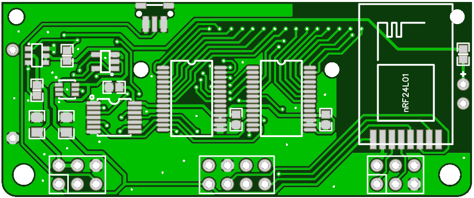
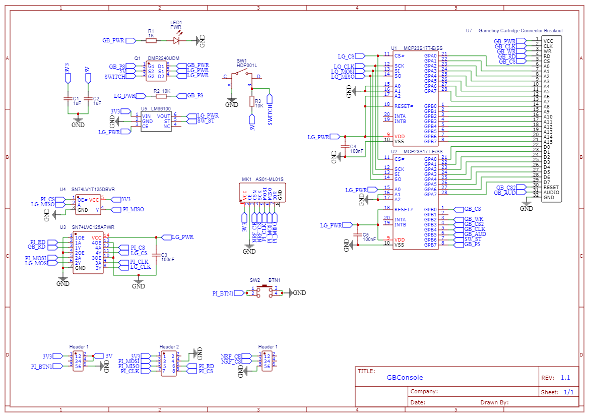
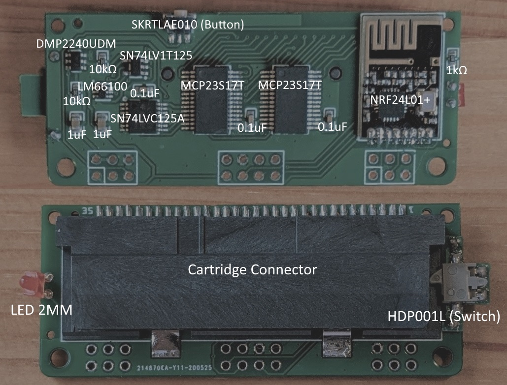

# GameBoy Console PCB

The GameBoy Console utilizes a custom PCB connected to the GPIO of a Raspberry Pi to help interface with GameBoy, GameBoy Color and GameBoy Advance cartridges. The PCB also includes space for an RF module to help connect to different wireless controllers. Along with the main board, there is a riser PCB for the detector swith and a flex PCB to help easy wire the main board to a Raspberry Pi.

## Schematic Overview
The circuitry consists primarily of two GPIO expander chips (MCP23S17T) to both reduce GPIO requirements and allow for easier logic shifting from 3.3 to 5 volts. There are two ICs (SN74LV1T125 and SN74LVC125A) which buffer the data signals coming from and to the Raspberry Pi. There are two additional ICs (LM66100 and DMP2240UDM) which help to switch the logic level and control power to the connected cartridge.

## Assembly
The gerber files for the main PCB (~1.4mm thickness) can be found [here](gerber/pcb_gerber.zip) and the gerber files for the detector switch PCB (~1mm thickness) can be found [here](gerber/pcb_switch_gerber.zip). Note that the detector switch is first soldered to its own PCB and then soldered to the main PCB. Additionally, a flex PCB for easier wiring can be found [here](gerber/pcb_connect_gerber.zip). Refer to the following diagram for how to assemble the PCB. 

## Parts
| Part | Footprint | Qty | Link |
| --- | --- | --- | --- |
| MCP23S17T | SSOP-28 | 2 | [mouser](https://www.mouser.com/ProductDetail/579-MCP23S17T-E-SS) |
| SN74LV1T125 | SOT-23-5 | 1 | [mouser](https://www.mouser.com/ProductDetail/595-74LV1T125DBVRG4) |
| SN74LVC125A | TSSOP-14 | 1 | [mouser](https://www.mouser.com/ProductDetail/595-SN74LVC125APWR) |
| LM66100 | SC70-6 | 1 | [mouser](https://www.mouser.com/ProductDetail/595-LM66100DCKT) |
| DMP2240UDM | SOT-26-6 | 1 | [mouser](https://www.mouser.com/ProductDetail/621-DMP2240UDM-7) |
| HDP001L (Switch) | SMT | 1 | [mouser](https://www.mouser.com/ProductDetail/611-HDP001L) |
| SKRTLAE010 (Button) | SMT | 1 | [mouser](https://www.mouser.com/ProductDetail/ALPS/SKRTLAE010?qs=4nKZKRgDHlm3FhoHNgWQ9A%3D%3D) |
| LED 2MM | Through Hole | 1 | [ebay](https://www.ebay.com/itm/1-8mm-2mm-3mm-5mm-8mm-10mm-LED-Diodes-Diffused-White-Red-Blue-Lights-Lamp-Blub/123839145932) |
| GBA Cartridge Connector | SMT | 1 | [ebay](https://www.ebay.com/itm/For-Nintendo-DS-NDS-GBA-Game-Cartridge-Card-Reader-Slot-Repair-Part/323815654861) |
| NRF24L01+ | SMT | 1 | [ebay](https://www.ebay.com/itm/NRF24L01-SMD-Wireless-Transceiver-Module-1-9-3-6V-1-27-2-4-GHz-MM-Mini-Board/233433878914) |
| CAP 0.1uF | 0603 | 3 | |
| CAP 1uF | 0805 | 2 | |
| RES 10k | 0603 | 2 | |
| RES 1k | 0603 | 1 | |

## Wiring to Raspberry Pi
The PCB is designed to sit off to the side of the Raspberry Pi GPIO with jumper wires soldered to the corresponding pads. The provided flex PCB can be used to avoid having to cut and strip tiny wires. Note that it is a good idea to seat the boards in the case and tape them together before soldering so the spacing is correct.

Not all the connections are used at this time so some of them can be skipped (the ones not soldered in the diagram) but it doesn't hurt to solder them all. Also remember to seat the boards in the case and tape them together before soldering to make things easier.

